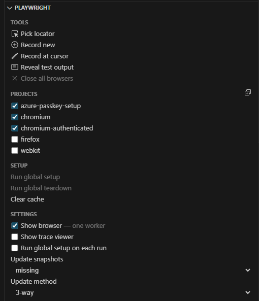
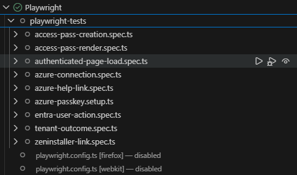

# Playwright Tests

Two Options include running the tests from Testing Tab or using the terminal.

## Prerequisites

1. Install all the project dependencies from the repository root:
```bash
pnpm i
```

2. Install the Playwright browser binaries the first time you set up the workspace:
```bash
pnpm exec playwright install
```

3. Download "Playwright Test for VSCode" extension for Playwright Test Tab

4. Create your local `src/pwtests/access-pass-src/auth/data/access-pass-users.local.json` file.
 - Use the `src/pwtests/access-pass-src/auth/data/access-pass-users.example.json` example template for reference.
 - Update `access-pass-users.local.json` with the users and tenant data that match your environment. Authenticated tests are skipped when it is missing.


## OPTION 1: Running from the Playwright Test Tab 

### 1. Enable the following options in the Playwright menu.



### 2. Press the 'Run Test' icon next to Playwright dropdown.



### 3. Log in as test users to generate .auth files when prompted.
 - Manually log in using test UPN + passkey when prompted by the browser.
 - The generated .auth files can be reused without manual login for future testing.
 - Regeneration recommended if more than one hour passes since session info can expire.

### 4. Remaining tests will automatically run.

Ensure `RUN_ACCESS_PASS_CREATION=true` is set in your web .env file to allow Access Pass Creations tests to run.

### Updating snapshots
When UI change is expected, snapshots can be updated using the 'Update snapshots' option in Playwright menu.


## OPTION 2: Running Using the Terminal from Workspace Root

### 1. Generate .auth files for authenticated test setup

Generate the authentication state for each user by running the manual passkey setup flow:

```bash
pnpm run pwtest -- --project=azure-passkey-setup --headed --workers=1
```

- If you only want to prepare one configured user, set `ACCESS_PASS_AUTH_USER` to that user id before running the setup command.
- This step creates the `.auth` files under `src/pwtests/access-pass-src/auth/.auth/`.

### 2. Run the tests

Run the full Playwright suite from `accessPass/func`:

```bash
pnpm run pwtest -- --workers=1
```

Useful narrower runs:

```bash
pnpm run pwtest -- --project=access-pass --workers=1
pnpm run pwtest -- --project=access-pass-auth --workers=1
```

Ensure `RUN_ACCESS_PASS_CREATION=true` is set in your web .env file to allow Access Pass Creation tests to run.

### Updating snapshots

When a UI change is expected, update the Playwright screenshot baselines with:

```bash
pnpm run pwtest -- --update-snapshots
```

### Common failures

- Missing `src/pwtests/access-pass-src/auth/data/access-pass-users.local.json`: create it from the example file.
- Missing auth files: rerun the `azure-passkey.setup.ts` command.
- Unexplainable failed tests: regenerate .auth files.
- App not reachable: confirm the sibling Access Pass UI is available at `http://localhost:5173` and the backend is running.
