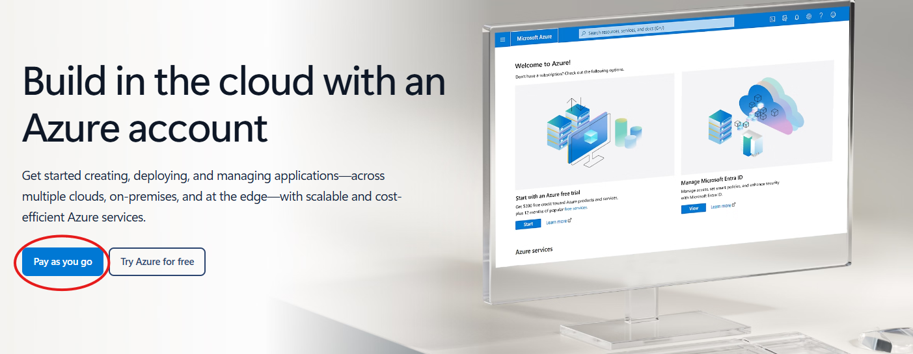
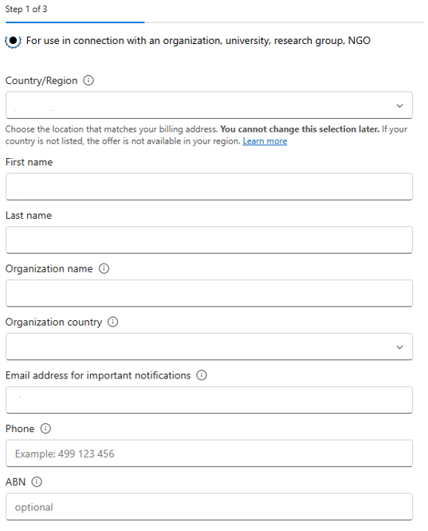
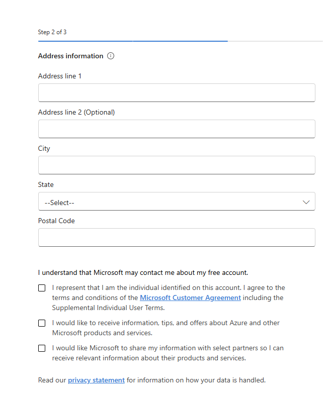
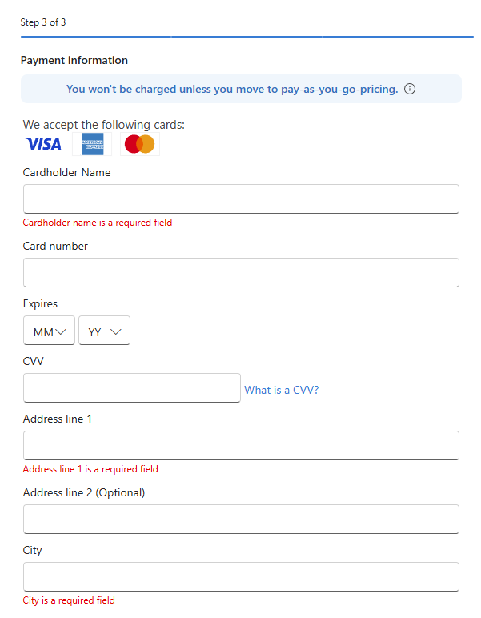

# How to Create a Free Azure Account

This guide walks through the steps required to create a Microsoft Entra ID tenant while signing up for an Azure free trial.

## Start the Azure Free Trial

1. Navigate to the Azure signup page: [https://azure.microsoft.com/en-gb/free/entra-id](https://azure.microsoft.com/en-gb/free/entra-id)

2. If you do not have a personal email account, create one at [https://www.microsoft.com/en-us/microsoft-365/outlook](https://www.microsoft.com/en-us/microsoft-365/outlook)

3. Select **Pay as you go**.

   

4. You will be prompted to sign in with an existing Microsoft account or create a new one.

5. After signing in, the system begins a three-step registration process.

## Step 1 of 3 — Organisation & Contact Information

This step establishes who is creating the tenant and which organisation it belongs to.

**Fields to Complete**

| **Field**                                     | **What to Enter**                                        | **Notes**                                               |
| --------------------------------------------- | -------------------------------------------------------- | ------------------------------------------------------- |
| **Personal use or for organisation**          | Choose "for use in connection with an organisation…"     | Cannot be changed later                                 |
| **Country/Region**                            | Select the country that matches your **billing address** | Cannot be changed later                                 |
| **First name**                                | Your legal first name                                    | Used for identity verification                          |
| **Last name**                                 | Your legal last name                                     | Used for identity verification                          |
| **Organisation name**                         | Name of your organisation                                | This becomes part of your Azure billing profile         |
| **Organisation country**                      | Country where the organisation is registered             | Often autofilled based on earlier selection             |
| **Email address for important notifications** | Your work email                                          | Azure sends billing, security, and service alerts here  |
| **Phone**                                     | A valid mobile or landline number                        | Used for identity verification                          |
| **ABN (optional)**                            | Leave this section empty                                 | Optional but recommended for organisations in Australia |

## Step 2 of 3 — Address & Agreements

This step collects your physical address and requires you to accept Microsoft's terms.

**Fields to Complete**

| **Field**          | **What to Enter**             | **Notes**                                   |
| ------------------ | ----------------------------- | ------------------------------------------- |
| **Address line 1** | Primary business address      | Required                                    |
| **Address line 2** | Suite, unit, or building info | Optional                                    |
| **City**           | City or suburb                | Required                                    |
| **State**          | Select from the dropdown      | Required                                    |
| **Postal Code**    | Valid postal code             | Required; form will not continue without it |

**Required Agreements**

You must check the box confirming:

- You are the individual identified on the account, and you agree to the **Microsoft Customer Agreement** and **Supplemental Individual User Terms**

**Optional Communication Preferences**

You may choose to opt in to:

- Product updates, tips, and offers from Microsoft
- Information from Microsoft partners

These do not affect your ability to proceed.

## Step 3 of 3 — Payment Verification

Azure requires a valid payment method to prevent fraud and confirm identity. **You will not be charged unless you later upgrade to Pay As You Go.**

**Fields to Complete**

| **Field**           | **What to Enter**                           | **Notes** |
| ------------------- | ------------------------------------------- | --------- |
| **Cardholder Name** | Name exactly as it appears on the card      | Required  |
| **Card Number**     | Valid Visa, Mastercard, or American Express | Required  |
| **Expiry (MM/YY)**  | Select month and year                       | Required  |
| **CVV**             | 3 or 4-digit security code                  | Required  |
| **Address line 1**  | Billing address for the card                | Required  |
| **Address line 2**  | Optional                                    |           |
| **City**            | City or suburb                              | Required  |
| **State**           | Select from the dropdown                    | Required  |
| **Postal Code**     | Valid postal code                           | Required  |

Once submitted, Microsoft will validate your card and complete the tenant creation.

## Completion

After all three steps are successfully submitted:

- Your **Azure subscription** is created
- Your **Microsoft Entra ID tenant** is provisioned
- You can immediately begin configuring users, groups, applications, and security settings
